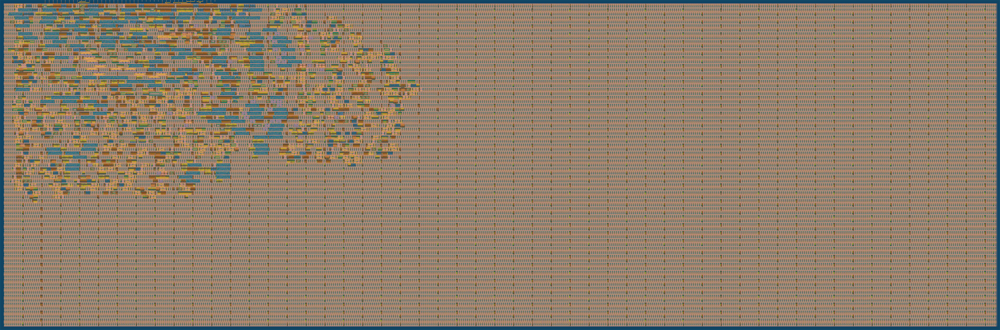

# SilicaFold V0

**Folded TensorTile + PolicyGate for Offline SLM Agents**

[](https://github.com/rahulraonatarajan/silicafold-offlyn.ai-chip/actions/workflows/test.yml)
[](https://github.com/rahulraonatarajan/silicafold-offlyn.ai-chip/actions/workflows/gds.yml)

> **SilicaFold V0 helps offline SLM agents compute locally and act safely.**

## Overview

SilicaFold V0 is a proof-of-silicon artifact for [Tiny Tapeout](https://tinytapeout.com) that validates two simplified chip-level primitives for offline Small Language Model (SLM) agent infrastructure:

1. **TensorTile**: A folded 4-lane INT4 QK dot-product primitive for compact context operations
2. **PolicyGate**: A deterministic tool-call authorization gate for allow/block/require-human decisions

This is an **educational V0 implementation**, not a production AI chip.

## What This Project Proves

- Folded INT4 tensor computation fits in Tiny Tapeout tiles
- Deterministic policy enforcement synthesizes cleanly in silicon
- Separation of compute (TensorTile) from authority (PolicyGate) is architecturally viable
- Open-source ASIC design is accessible for research

## Actual Silicon Layout

**This is real.** The image below shows the actual GDS (Graphic Data System) physical layout generated by the OpenLane ASIC flow — not a concept diagram, not a simulation, but the actual transistor-level design ready for fabrication:



### What You're Seeing

| Layer | Description |
|-------|-------------|
| **Blue/Cyan** | Metal routing layers (interconnect wires) |
| **Red/Pink** | Polysilicon (transistor gates) |
| **Green** | Active diffusion (transistor source/drain) |
| **Regular grid pattern** | Standard cells (AND, OR, flip-flops, buffers) |
| **Die boundary** | 4×2 Tiny Tapeout tiles = 682.64 × 225.76 µm |

### Verified Design Metrics

| Check | Status |
|-------|--------|
| **DRC** (Design Rule Check) | ✅ Clean — Magic + KLayout |
| **LVS** (Layout vs Schematic) | ✅ Clean — Netgen |
| **Timing** @ 25 MHz | ✅ No setup/hold violations |
| **Slew/Capacitance** | ✅ No violations |

### Download Artifacts

All outputs available from [GitHub Actions](https://github.com/rahulraonatarajan/silicafold-offlyn.ai-chip/actions):

| Artifact | Contents |
|----------|----------|
| `gds` | Final GDS file for fabrication |
| `gds_render` | PNG render (shown above) |
| `reports` | Synthesis, timing, utilization reports |
| `tt_submission` | Tiny Tapeout submission package |

---

## What This Project Does NOT Prove

- Production-grade performance
- Cryptographic security
- Full transformer inference capability
- Commercial viability

See [docs/limitations.md](docs/limitations.md) for a complete list.

## Why This Is NOT a TPU Clone

SilicaFold V0 is not competing with NVIDIA, Google TPU, Apple Neural Engine, or any commercial AI accelerator. It addresses a different problem space:

| Commercial AI Silicon | SilicaFold V0 |
|-----------------------|---------------|
| Maximize TOPS/watt | Validate architectural concepts |
| Datacenter/edge inference | Offline agent safety primitives |
| Full transformer acceleration | Single QK dot product primitive |
| Production-ready | Educational proof-of-silicon |

## Architecture

```
┌─────────────────────────────────────────────────────────────────┐
│                    Offline SLM Runtime (Host)                    │
│  ┌──────────────┐  ┌──────────────┐  ┌──────────────────────┐   │
│  │ SLM Inference│  │ Context Mgmt │  │ Tool Call Generator  │   │
│  │  (Reasoning) │  │ (KV Cache)   │  │ (Structured Packets) │   │
│  └──────────────┘  └──────────────┘  └──────────────────────┘   │
└─────────────────────────────────────────────────────────────────┘
                              │
                              ▼
┌─────────────────────────────────────────────────────────────────┐
│                     SilicaFold V0 (Chip)                        │
│  ┌─────────────────────┐      ┌─────────────────────────────┐   │
│  │     TensorTile      │      │        PolicyGate           │   │
│  │  ─────────────────  │      │  ─────────────────────────  │   │
│  │  8x INT4 Q/K regs   │      │  Tool ID + Risk Class       │   │
│  │  4-Lane Folded MAC  │      │  Context/Policy Flags       │   │
│  │  16-bit Accumulator │      │  Decision Logic             │   │
│  └─────────────────────┘      └─────────────────────────────┘   │
│         │                              │                        │
│         ▼                              ▼                        │
│   Context Score              Allow/Block/RequireHuman           │
└─────────────────────────────────────────────────────────────────┘
```

**Important**: The chip does not understand natural language. The trusted runtime converts SLM outputs into structured tool-call packets. PolicyGate evaluates those structured fields.

## TensorTile

TensorTile computes an 8-element INT4 dot product using a folded 4-lane MAC:

- **Inputs**: 8 signed INT4 Q values, 8 signed INT4 K values
- **Computation**: 2 cycles (4 elements per cycle)
- **Output**: Signed 16-bit result with optional scale shift
- **Flags**: busy, done, overflow, context_valid

This is a toy primitive demonstrating folded computation, not a full attention mechanism.

## PolicyGate

PolicyGate evaluates structured tool-call requests:

| Input | Description |
|-------|-------------|
| tool_id | 4-bit tool identifier |
| risk_class | 0=low, 1=medium, 2=high, 3=emergency |
| context_valid | Context has been validated |
| policy_ok | Policy permits this action type |
| human_approved | Human has pre-approved |
| offline_mode | System is offline |
| battery_low | Power conservation mode |
| emergency_mode | Emergency override active |

| Output | Description |
|--------|-------------|
| ALLOW | Tool may execute |
| BLOCK | Tool must not execute |
| REQUIRE_HUMAN | Human approval required |
| LOG_REQUIRED | Action must be logged |

See [docs/architecture.md](docs/architecture.md) for detailed decision logic.

## Pin Configuration

| Pin | Direction | Function |
|-----|-----------|----------|
| ui_in[3:0] | Input | Command nibble |
| ui_in[7:4] | Input | Data nibble |
| uo_out[3:0] | Output | Status bits |
| uo_out[7:4] | Output | Data output |
| uio_in[0] | Input | WR_STB |
| uio_in[1] | Input | RD_STB |
| uio_in[2] | Input | BLOCK_SELECT (0=TensorTile, 1=PolicyGate) |
| uio_in[3] | Input | DEBUG_MODE |
| uio_out[7:4] | Output | Extended status |

## Running Simulation

### Prerequisites

- Python 3.8+
- Icarus Verilog
- cocotb

### Run Tests

```bash
cd test
make SIM=icarus
```

### Verify Verilog Syntax

```bash
cd src
iverilog -g2005 -Wall -t null *.v
```

## Generating GDS via GitHub Actions

The primary path for GDS generation is GitHub Actions:

1. Push changes to the `main` branch
2. The GDS workflow runs automatically
3. Download artifacts from the Actions tab:
   - `gds` - Final GDS file
   - `reports` - Synthesis and timing reports
   - `openlane-run` - Complete run directory

See [docs/gds_artifacts.md](docs/gds_artifacts.md) for artifact details.

## Submitting to Tiny Tapeout

1. Complete the [submission checklist](docs/submission_checklist.md)
2. Verify GDS workflow passes
3. Review synthesis and timing reports
4. Go to [tinytapeout.com](https://tinytapeout.com)
5. Link this repository
6. Select tile count (4x2 recommended)
7. Complete submission

## Estimated Cost

| Configuration | Tiles | Estimated Cost |
|---------------|-------|----------------|
| Recommended (4x2) | 8 | ~€875 |
| Lean combined | 6 | ~€735 |
| Minimum | 1 | ~€385 |

See [docs/cost_report.md](docs/cost_report.md) for details.

## Public vs Commercial Boundary

This public V0 demonstrates simplified open-silicon primitives only. The commercial opportunity is not the toy RTL alone. The commercial opportunity is the full offline SLM-agent stack: runtime integration, signed policy lifecycle, context validity, audit infrastructure, field workflows, secure deployment, and future silicon IP. Those production components are intentionally not included in this repository.

See [docs/public_vs_commercial_boundary.md](docs/public_vs_commercial_boundary.md) and [IP_STRATEGY.md](IP_STRATEGY.md) for details.

## Long-Term Roadmap

| Version | Description |
|---------|-------------|
| V0 (current) | Tiny Tapeout proof-of-silicon |
| V0.5 | FPGA demo with live SLM runtime |
| V0.6 | OpenROAD PPA comparison study |
| V0.7 | Open3DBench 3D research |
| V1 | MPW prototype with SRAM/DMA |
| V2 | Commercial silicon IP |

See [docs/long_term_asic_roadmap.md](docs/long_term_asic_roadmap.md) for details.

## Repository Structure

```
silicafold-offlyn.ai-chip/
├── README.md                 # This file
├── LICENSE                   # Apache-2.0
├── NOTICE.md                 # Attribution notice
├── IP_STRATEGY.md            # IP protection guidelines
├── info.yaml                 # Tiny Tapeout metadata
├── src/
│   ├── tt_um_*.v             # Top module
│   ├── sf_tensortile_core.v  # TensorTile implementation
│   └── sf_policygate_core.v  # PolicyGate implementation
├── test/
│   ├── test_combined.py      # Cocotb testbench
│   └── Makefile              # Test runner
├── docs/                     # Documentation
├── scripts/                  # Utility scripts
├── sim/                      # Simulation outputs
├── gds/                      # GDS references
├── reports/                  # OpenLane reports
├── assets/                   # Images and diagrams
└── .github/workflows/        # CI/CD
```

## Documentation

- [Architecture](docs/architecture.md) - Detailed block diagrams and data flow
- [Limitations](docs/limitations.md) - What V0 does NOT do
- [Cost Report](docs/cost_report.md) - Tiny Tapeout pricing
- [Submission Checklist](docs/submission_checklist.md) - Pre-submission verification
- [Bring-Up Plan](docs/bringup_plan.md) - Post-silicon testing
- [GDS Artifacts](docs/gds_artifacts.md) - Where to find generated outputs
- [Local Hardening](docs/local_hardening.md) - Optional local OpenLane flow
- [Investor/Resume Pitch](docs/investor_resume_pitch.md) - Public messaging guide

## License

Apache-2.0. See [LICENSE](LICENSE) and [NOTICE.md](NOTICE.md).

## Acknowledgments

- [Tiny Tapeout](https://tinytapeout.com) for accessible silicon fabrication
- [OpenLane](https://github.com/The-OpenROAD-Project/OpenLane) for open-source ASIC flow
- [SKY130 PDK](https://github.com/google/skywater-pdk) for open process design kit
- [cocotb](https://www.cocotb.org/) for Python-based testbench framework

## Contact

- Repository: https://github.com/rahulraonatarajan/silicafold-offlyn.ai-chip
- Author: Rahul Rao Natarajan

---

*SilicaFold V0 helps offline SLM agents compute locally and act safely.*
