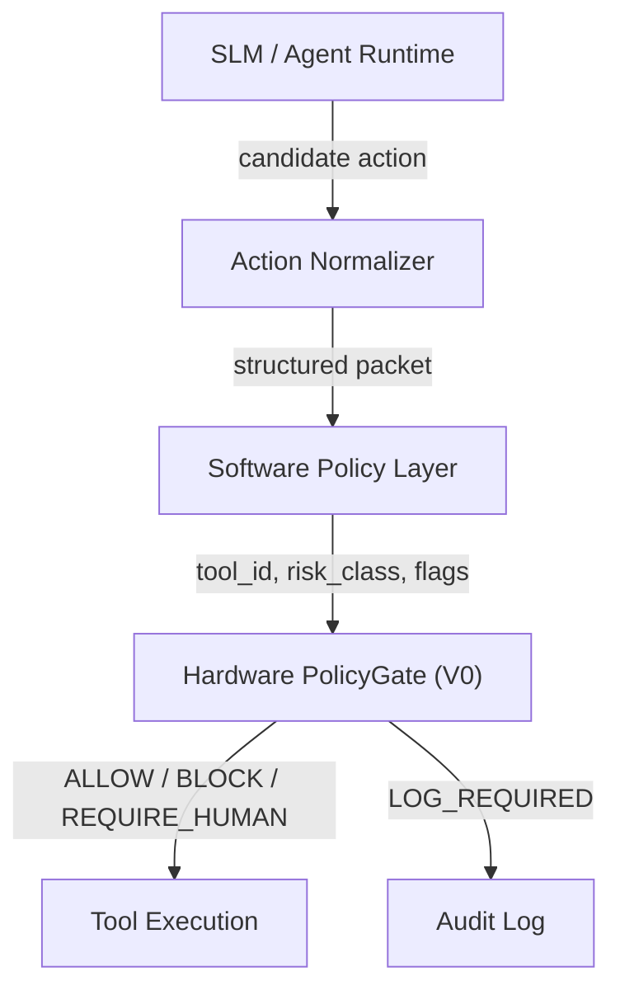
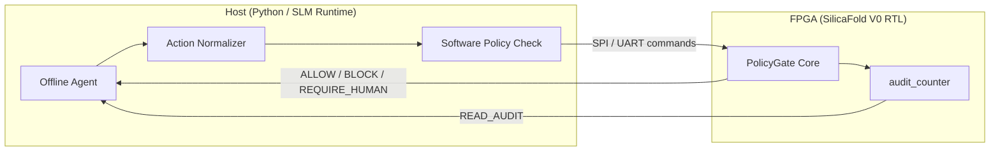

# Offlyn Verify Core + SilicaFold V0 Integration

## Introduction

SilicaFold V0's **PolicyGate** is the silicon-level cousin of **Offlyn Verify Core**'s policy-at-actuation-boundary enforcement. The host system still runs the SLM, context manager, and tool-call generator. PolicyGate does not understand natural language. Instead, the trusted runtime converts model outputs into structured tool-call packets, and PolicyGate returns a deterministic allow, block, or require-human decision before actuation proceeds.

This document describes how the educational V0 primitive maps to the broader Offlyn Verify Core architecture. It covers the conceptual integration surface only. Production policy lifecycle, cryptographic verification, and runtime integration remain proprietary Offlyn.ai systems. See [public_vs_commercial_boundary.md](public_vs_commercial_boundary.md) for what is and is not in this repository.

## Layered Architecture

Policy enforcement is split across four layers. V0 implements the hardware layer only.

### Runtime Layer

The SLM generates a candidate action (for example, "send emergency beacon" or "export file"). The runtime normalizes that intent into a structured packet:

- `tool_id` — which tool or action class is requested
- `risk_class` — LOW, MEDIUM, HIGH, or EMERGENCY
- Context and policy flags — validity, approval, connectivity, power state

The chip never sees raw model text. See [architecture.md](architecture.md) for the host integration diagram.

### Software Policy Layer

At the runtime level, Offlyn Verify Core evaluates high-level intent against policy rules (for example, OPA or signed policy documents). This layer decides whether an action type is permitted in principle and sets the `policy_ok` flag before the packet reaches hardware.

This repository does not include production policy infrastructure. The software layer is referenced here to show where V0 fits in a complete stack.

### Hardware Policy Layer

V0 PolicyGate (`sf_policygate_core.v`) evaluates the structured fields through a six-priority decision tree. On `CMD_EVALUATE`, it latches one of:

| Output | Meaning |
|--------|---------|
| `allow` | Tool may execute |
| `block` | Tool is blocked |
| `require_human` | Human approval required before execution |
| `log_required` | Action must be recorded in the audit trail |

Extended status signals include `policy_error`, `high_risk`, `emergency_path`, and `evaluated`. See [architecture.md](architecture.md) for the full priority flow.

### Audit Layer

Every evaluation that sets `log_required` increments the 4-bit `audit_counter`. The counter persists across `CMD_RESET_STATE` (soft reset), providing basic tamper evidence that a reset alone cannot erase the event count.

In a production stack, the host runtime reads `READ_AUDIT` and appends structured log entries. Future versions may add hardware audit digests and append-only secure logging (see [long_term_asic_roadmap.md](long_term_asic_roadmap.md)).

## Field Mapping: Verify Core to PolicyGate V0

| Verify Core Concept | PolicyGate V0 Signal | Width | Notes |
|---------------------|----------------------|-------|-------|
| `action_type` | `tool_id` | 4-bit | Encodes tool class; safety-critical IDs are 0x1–0x3, nonessential are 0x8–0xF |
| `risk_level` | `risk_class` | 2-bit | 0=LOW, 1=MEDIUM, 2=HIGH, 3=EMERGENCY |
| `context_validity` | `context_valid` | 1-bit | Loaded via `CMD_LOAD_FLAGS`, `din[0]` |
| `policy_version_ok` | `policy_ok` | 1-bit | Loaded via `CMD_LOAD_FLAGS`, `din[1]` |
| `human_approval` | `human_approved` | 1-bit | Loaded via `CMD_LOAD_FLAGS`, `din[2]` |
| `connectivity_state` | `offline_mode` | 1-bit | Loaded via `CMD_LOAD_FLAGS`, `din[3]` |
| `power_state` | `battery_low` | 1-bit | Loaded via `CMD_LOAD_POWER_EMERG`, `din[0]` |
| `override_mode` | `emergency_mode` | 1-bit | Loaded via `CMD_LOAD_POWER_EMERG`, `din[1]` |

### Command Sequence

A typical host-to-PolicyGate transaction:

1. `CMD_LOAD_TOOL_ID` — set `tool_id`
2. `CMD_LOAD_RISK_CLASS` — set `risk_class`
3. `CMD_LOAD_FLAGS` — set context, policy, approval, and offline flags
4. `CMD_LOAD_POWER_EMERG` — set battery and emergency flags
5. `CMD_EVALUATE` — latch decision outputs
6. `CMD_READ_DECISION` — read `{log_required, require_human, block, allow}`

Set `BLOCK_SELECT=1` on `uio_in[2]` to route commands to PolicyGate instead of TensorTile.

## What V0 Proves

SilicaFold V0 demonstrates that the architectural concept synthesizes into real silicon:

- **Deterministic policy evaluation** — a priority-ordered decision tree implements in combinational logic and synthesizes cleanly on SKY130 via the Tiny Tapeout flow
- **Correct and testable behavior** — 16/16 cocotb tests pass at RTL and gate level (see [current_submission_status.md](current_submission_status.md))
- **Basic audit persistence** — `audit_counter` survives soft reset, so a state reset alone cannot zero the event count
- **Compute/authority separation** — `BLOCK_SELECT` muxes TensorTile (compute) and PolicyGate (authority) on a single die, matching the "compute vs authority" split in [architecture.md](architecture.md)

V0 does **not** prove cryptographic security, production performance, or commercial viability. See [limitations.md](limitations.md).

## What Production Extends

The public V0 primitive is intentionally simplified. Production Offlyn Verify Core and future SilicaFold revisions extend it with:

| Capability | V0 Status | Production Direction |
|------------|-----------|---------------------|
| Signed policy registers | Not implemented | Cryptographic policy verification at load time |
| Context attestation | Runtime sets flag | Signed context hash verified before `context_valid` |
| Hardware audit digest | Counter only | Append-only secure log with signed event records |
| Secure boot chain | Not implemented | Measured boot ensures PolicyGate runs trusted firmware |
| Pin authentication | Open pin interface | Challenge-response or signed command packets |

For the full timeline from V0 through commercial IP, see [long_term_asic_roadmap.md](long_term_asic_roadmap.md).

## V0.5 FPGA Demo Integration (Planned)

The V0.5 milestone targets a hardware-in-the-loop demo with a live SLM runtime driving PolicyGate on an FPGA board.

Expected flow:

1. Host runs a local SLM or mock agent that proposes a tool call
2. Runtime normalizes the call and runs software policy checks
3. Host sends PolicyGate commands over SPI or UART (same command encoding as the Tiny Tapeout pin interface)
4. FPGA evaluates and returns the decision
5. Host executes, blocks, or escalates based on the hardware result
6. Host reads `audit_counter` and writes a software audit log entry

Target FPGA platforms are listed in [long_term_asic_roadmap.md](long_term_asic_roadmap.md) (iCE40, ECP5, Arty A7). This demo is not yet implemented in the repository.

## Related Documents

| Document | Purpose |
|----------|---------|
| [architecture.md](architecture.md) | RTL data flow and decision tree |
| [policygate_threat_model.md](policygate_threat_model.md) | Threat landscape and V0 defenses |
| [use_cases.md](use_cases.md) | Concrete offline-agent scenarios |
| [limitations.md](limitations.md) | What V0 does not implement |
| [public_vs_commercial_boundary.md](public_vs_commercial_boundary.md) | Public vs proprietary IP boundary |
