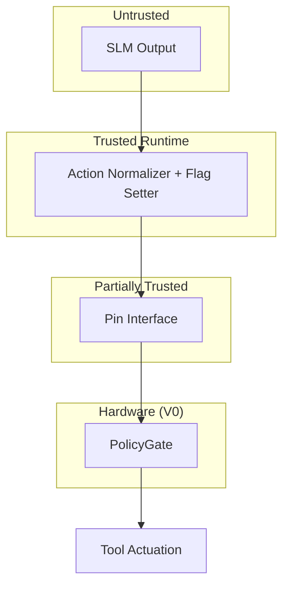

# PolicyGate Threat Model

## Scope

This document describes the threat landscape that PolicyGate is designed to address and where SilicaFold V0's defenses stop. It is an **educational threat model** for the V0 proof-of-silicon, not a formal security analysis or certification artifact.

PolicyGate V0 is a toy demonstration of deterministic policy enforcement at the actuation boundary. It does not implement cryptographic verification, secure boot, tamper resistance, or side-channel hardening. See [limitations.md](limitations.md) for the full list of non-goals.

For how PolicyGate fits into the broader Offlyn Verify Core stack, see [offlyn_verify_core_integration.md](offlyn_verify_core_integration.md).

## System Model

PolicyGate sits between a trusted host runtime and physical tool execution. The trust boundaries are:

| Component | Trust Level | Rationale |
|-----------|-------------|-----------|
| Host runtime | **Trusted** | Converts SLM output to structured packets and sets flag values |
| SLM output | **Untrusted** | Model may hallucinate, be prompt-injected, or propose unauthorized actions |
| Physical pin interface (`ui_in`) | **Partially trusted** | No authentication or encryption in V0; any entity with pin access can send commands |
| PolicyGate hardware | **Trusted (within V0 scope)** | Evaluates loaded registers deterministically; does not interpret natural language |

## Threat Table

| ID | Threat | Description | V0 Mitigation | Future Mitigation |
|----|--------|-------------|---------------|-------------------|
| T1 | Unauthorized tool call | Model proposes an action outside current policy | PolicyGate blocks if `!policy_ok` (Priority 1) with `policy_error` and `log_required` | Signed policy with cryptographic verification at load time |
| T2 | Invalid context exploitation | Runtime reports `context_valid=1` when context is stale, corrupted, or unverified | PolicyGate blocks if `!context_valid && risk_class >= MEDIUM` (Priority 2) | Context validity attestation via signed hash before flag is set |
| T3 | Risk escalation bypass | Attacker or buggy runtime sets `risk_class` lower than the true risk of the action | V0 relies on trusted runtime to set correct `risk_class`; hardware does not independently classify risk | Hardware-enforced risk classification; signed action packets with embedded risk level |
| T4 | Emergency override abuse | Attacker sets `emergency_mode=1` to bypass normal policy checks | Emergency path (Priority 5) applies only when `tool_is_safety_critical` (IDs 0x1, 0x2, 0x3) and always sets `log_required` | Bounded emergency-mode policy; time-limited emergency tokens; per-session emergency counters |
| T5 | Audit counter tampering | Attacker resets or suppresses the audit trail after a policy event | `audit_counter` is **not** cleared by `CMD_RESET_STATE`; increments on every `log_required` evaluation | Hardware audit digest; append-only secure log; signed counters |
| T6 | Pin-level injection | Attacker drives `ui_in` directly, bypassing the runtime and sending arbitrary commands | V0 has no pin authentication; any entity with physical access can load registers and evaluate | Challenge-response before command acceptance; signed command packets; secure pin mux |

## Attack Scenarios

### Scenario 1: Rogue Model Output (Priority 3)

**Setup:** An offline SLM proposes motor actuation on a field drone.

| Field | Value |
|-------|-------|
| `tool_id` | 0x2 (safety-critical) |
| `risk_class` | HIGH (2) |
| `policy_ok` | 1 |
| `context_valid` | 1 |
| `human_approved` | 0 |

**Flow:**

1. Runtime loads tool ID, risk class, and flags
2. Runtime issues `CMD_EVALUATE`
3. Priority 1 (`policy_ok`) passes
4. Priority 2 (`context_valid`) passes
5. Priority 3 matches: `risk_class == HIGH && !human_approved`

**Result:** `require_human=1`, `log_required=1`. The drone does not actuate until a human approves. The `audit_counter` increments.

This is the primary defense against model-proposed high-risk physical actions.

### Scenario 2: Stale Context (Priority 2)

**Setup:** A runtime fails to refresh its context window before requesting a medium-risk action.

| Field | Value |
|-------|-------|
| `tool_id` | 0x5 |
| `risk_class` | MEDIUM (1) |
| `policy_ok` | 1 |
| `context_valid` | 0 |

**Flow:**

1. Runtime loads fields with `context_valid=0`
2. Runtime issues `CMD_EVALUATE`
3. Priority 1 passes
4. Priority 2 matches: `!context_valid && risk_class >= MEDIUM`

**Result:** `block=1`, `log_required=1`. The action is blocked because the context has not been validated for a medium-or-higher-risk request.

**V0 limitation:** PolicyGate trusts whatever value the runtime writes into `context_valid`. It cannot independently verify context freshness.

### Scenario 3: Emergency Override Abuse (Priority 5 Not Triggered)

**Setup:** An attacker or compromised runtime sets `emergency_mode=1` for a non-safety-critical tool to bypass policy.

| Field | Value |
|-------|-------|
| `tool_id` | 0xA (nonessential, >= 0x8) |
| `risk_class` | HIGH (2) |
| `emergency_mode` | 1 |
| `policy_ok` | 1 |
| `context_valid` | 1 |
| `human_approved` | 0 |

**Flow:**

1. Priority 1 passes
2. Priority 2 passes
3. Priority 3 matches: `risk_class == HIGH && !human_approved`

**Result:** `require_human=1`, `log_required=1`. The emergency path (Priority 5) does **not** activate because `tool_is_safety_critical` is false for tool ID 0xA.

Emergency override is scoped to safety-critical tools only. Setting `emergency_mode` on a nonessential tool does not bypass high-risk human-approval requirements.

### Scenario 4: Audit Counter Persistence (T5)

**Setup:** After a logged policy event, an attacker issues `CMD_RESET_STATE` to clear all registers.

**Flow:**

1. A prior evaluation set `log_required=1`, incrementing `audit_counter` to N
2. Attacker sends `CMD_RESET_STATE`
3. All policy registers and decision outputs reset to zero
4. `audit_counter` remains at N

**Result:** The event count survives soft reset. An attacker cannot use reset alone to erase evidence that logged evaluations occurred.

**V0 limitation:** The counter is 4 bits (wraps at 15) and is not cryptographically protected.

## Residual Risks

V0 cannot defend against the following. These are honest limitations, not bugs:

| Risk | Why V0 Cannot Mitigate |
|------|------------------------|
| Compromised runtime | Runtime can set any flag value before evaluation; hardware has no independent verification |
| Physical pin access | No authentication on the command interface; direct pin drive bypasses runtime entirely |
| Replay attacks | No nonce or timestamp; the same packet can be re-evaluated indefinitely |
| Policy versioning / revocation | No policy version register; `policy_ok` is a single bit with no lifecycle |
| Side-channel leakage | Not analyzed; no constant-time or power-analysis countermeasures |
| Counter overflow | 4-bit `audit_counter` wraps silently after 15 logged events |
| Runtime lies about all flags | If runtime sets `policy_ok=1`, `context_valid=1`, `human_approved=1`, and `risk_class=LOW`, PolicyGate will allow almost any tool |

These residual risks are expected for an educational V0. Production systems address them through the extensions described in [offlyn_verify_core_integration.md](offlyn_verify_core_integration.md) and [long_term_asic_roadmap.md](long_term_asic_roadmap.md).

## Recommendations for V1+

Based on this threat model, the highest-priority hardening steps for future SilicaFold revisions are:

1. **Signed policy registers** — verify policy integrity before `policy_ok` can be set by hardware
2. **Context attestation** — require a signed context hash; hardware sets `context_valid` only after verification
3. **Signed command packets** — authenticate the pin interface so only the trusted runtime can load registers
4. **Bounded emergency mode** — time-limited emergency tokens with per-session counters and mandatory logging
5. **Hardware audit digest** — append-only event log with cryptographic chaining, replacing the 4-bit counter
6. **Secure boot** — measured boot ensures PolicyGate firmware and policy state are trusted at power-on

See [long_term_asic_roadmap.md](long_term_asic_roadmap.md) for the V0.5 (FPGA demo) through V2 (commercial IP) timeline.

## Related Documents

| Document | Purpose |
|----------|---------|
| [offlyn_verify_core_integration.md](offlyn_verify_core_integration.md) | Verify Core layered architecture |
| [use_cases.md](use_cases.md) | Scenarios mapped to PolicyGate priorities |
| [limitations.md](limitations.md) | V0 non-goals |
| [architecture.md](architecture.md) | Decision tree and signal definitions |
| [public_vs_commercial_boundary.md](public_vs_commercial_boundary.md) | Proprietary security IP boundary |
